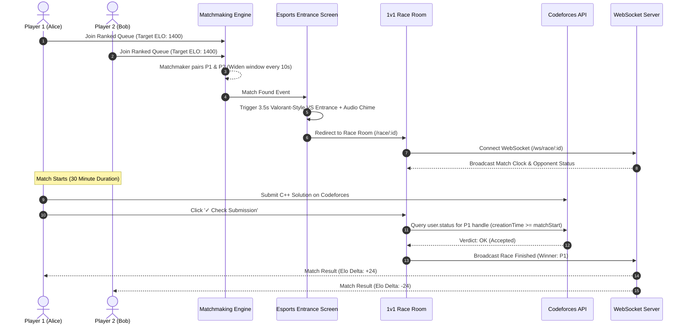
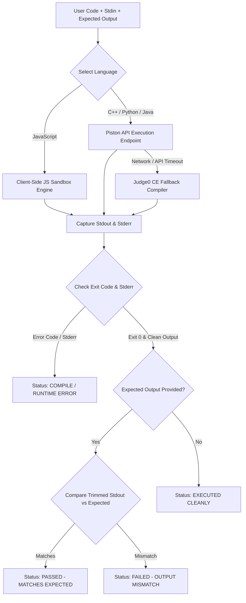

# ⚡ CodeClash — Real-Time 1v1 Competitive Programming Esports Platform

> **CodeClash** is a state-of-the-art, real-time competitive programming platform designed for speed clashes on authentic Codeforces problems. Featuring Elo-rated matchmaking, Valorant-style match entrances, an embedded multi-language IDE with local compilation, a smart non-destructive algorithm snippet vault, dynamic analytics radar charts, 3D holographic badges, and a zero-asset Web Audio synthesizer.

---

## 📑 Table of Contents
1. [Technical Stack](#-technical-stack)
2. [System Design & Architecture Flowcharts](#-system-design--architecture-flowcharts)
3. [Algorithmic & Mathematical Models](#-algorithmic--mathematical-models)
4. [Exhaustive Feature Directory](#-exhaustive-feature-directory)
5. [Performance Optimizations & Resilience](#-performance-optimizations--resilience)
6. [Project Directory Structure](#-project-directory-structure)
7. [Installation & Local Setup](#-installation--local-setup)
8. [Environment Variables](#-environment-variables)

---

## 🛠 Technical Stack

### Frontend Subsystems
- **Core Framework**: React 18, Vite 5, React Router v6
- **Styling & Micro-Interactions**: Tailwind CSS v4, Vanilla CSS Custom Variables, Framer Motion (3D spring physics, layout animations, cyber curtain route transitions with `AnimatePresence`)
- **Global Command Palette**: `Ctrl + K` / `⌘K` glassmorphic search overlay (`CommandPalette.jsx`) with 3D rotating SVG icons and `scrollIntoView` viewport tracking
- **Code Studio IDE**: Custom Monaco-inspired editor (`CyberMonacoEditor.jsx`) supporting C++ 17 (g++), Python 3.10, Java 17, and JavaScript (Node 18) with smart auto-indentation and diff output comparison
- **Smart Snippet Vault**: 1-click non-destructive algorithm snippet insertion (`CPSnippetVault.jsx`) featuring Fast I/O, Modular Exponentiation, DSU, and Segment Trees
- **Dynamic Analytics**: Recharts engine rendering live 6-axis Radar skill distribution charts and Win/Loss pie charts
- **Audio Synthesizer**: Custom Web Audio API synthesizer (`SoundContext.jsx`) utilizing low-latency Web Audio API Oscillators, GainNodes, and Chrome async context resolution (Zero external MP3/WAV assets)
- **Toast Notifications**: React Hot Toast

### Backend Subsystems
- **API Framework**: FastAPI (Python 3.10+) running on Uvicorn ASGI high-performance server
- **Real-Time WebSockets**: FastAPI WebSockets for live race events, opponent state broadcasting, and match countdown clocks
- **Database Layer**: PostgreSQL via `asyncpg` (with SQLite fallback for local development)
- **Security & Authentication**: JWT Tokens (`python-jose`) + Password Hashing (`bcrypt`)
- **Scraping Engine**: `httpx` + `BeautifulSoup4` for live Codeforces problem statement scraping and CORS proxying

### Execution & Verification Engine
- **Primary Execution API**: Piston API (`https://emkc.org/api/v2/piston/execute`)
- **Secondary Compiler Engine**: Judge0 CE API (`https://ce.judge0.com/submissions`)
- **Client-Side Evaluation Engine**: In-browser JavaScript sandbox with stdout/stderr capture
- **Codeforces Resilience Layer**: Official REST API + Multi-Proxy Fallback Cluster (`corsproxy.io` $\rightarrow$ `api.allorigins.win` $\rightarrow$ `api.codetabs.com`)

---

## 🏛 System Design & Architecture Flowcharts

### 1. High-Level System Topology Architecture

```mermaid
graph TD
    Client["💻 Client Frontend (React 18 + Vite + Tailwind)"]
    
    subgraph Frontend Subsystems
        Monaco["⚡ Monaco Code Studio IDE"]
        Sound["🔊 WebAudio Synthesizer"]
        CmdPal["🔍 Ctrl+K Command Palette"]
        Animate["✨ Framer Motion Router"]
        Snippet["📦 Smart Snippet Vault"]
    end
    
    Client --> Monaco
    Client --> Sound
    Client --> CmdPal
    Client --> Animate
    Client --> Snippet

    subgraph Core Backend Platform (FastAPI + Uvicorn)
        REST["🔌 REST API Server (Port 8000)"]
        WS["⚡ WebSocket Connection Manager"]
        JudgeEngine["⚖️ Codeforces Verdict Engine"]
        EloCalc["📈 Elo Rating Calculator Engine"]
    end

    Client -- HTTP Requests --> REST
    Client -- Full-Duplex WebSockets --> WS

    subgraph Data & Storage Layer
        DB[("🗄️ PostgreSQL / SQLite Database")]
    end

    REST --> DB
    WS --> DB
    JudgeEngine --> REST

    subgraph External Systems & Compilers
        CF_API["🌐 Codeforces Official REST API"]
        Piston["⚡ Piston Compilation API"]
        CORS_Proxy["🛡️ CORS Proxy Fallback Cluster"]
    end

    JudgeEngine -- Verdict Verification --> CF_API
    Monaco -- Code Execution --> Piston
    Client -- Client-side Scraping --> CORS_Proxy
    CORS_Proxy --> CF_API
```

---

### 2. 1v1 Ranked Matchmaking & Clash Flowchart



---

### 3. Local Code Execution & Diff Comparison Pipeline



---

## 🧮 Algorithmic & Mathematical Models

### 1. Elo Rating Recalculation Model ($K = 32$)
CodeClash enforces a zero-sum **Elo Rating Algorithm** for all 1v1 ranked clashes:

#### Expected Score Formula
$$E_A = \frac{1}{1 + 10^{(R_B - R_A) / 400}}$$

$$E_B = \frac{1}{1 + 10^{(R_A - R_B) / 400}}$$

#### Rating Update Formula
$$R_A' = R_A + K \cdot (S_A - E_A)$$
$$R_B' = R_B + K \cdot (S_B - E_B)$$

Where $S_A = 1$ if Player A wins, $S_A = 0$ if Player A loses.

---

### 2. Real-Time Dynamic Topic Skill Proficiency Model
In the **Analytics Engine**, topic skill levels are dynamically calculated from actual solved Codeforces problem tags and 1v1 match wins:

$$\text{Proficiency}_T = \min\left(100, \max\left(25, \frac{\text{User Elo}}{25} + 7 \times \text{CF Solved}_T + 12 \times \text{Clash Wins}_T\right)\right)$$

Where:
- $\text{CF Solved}_T$: Number of unique problems solved on Codeforces matching topic tag $T$.
- $\text{Clash Wins}_T$: Number of 1v1 match victories on problems containing topic tag $T$.

---

## 💎 Exhaustive Feature Directory

### 1. Embedded Monaco Code Studio & Smart Snippet Vault (`CyberMonacoEditor.jsx`, `CPSnippetVault.jsx`)
- **Multi-Language Support**: C++ 17 (g++), Python 3.10, Java 17, JavaScript (Node.js 18).
- **Smart Non-Destructive Snippet Engine**:
  - `⚡ Fast I/O`: Injects `ios_base::sync_with_stdio(false); cin.tie(NULL);` **directly inside `main()`**.
  - `🌐 DSU`, `🔢 ModPow`, `🌲 SegTree`: Injects helper structs and functions **ABOVE `int main()`** without overwriting existing solution code.
- **Smart Indentation & Auto-Brackets**: Preserves leading indentation on newline, indents +4 spaces on opening blocks `{`, `:`, `(`, and auto-closes bracket pairs.
- **Diff & Result Verdict Engine**: Compares program stdout against expected output with visual status badges (`✓ PASSED`, `⚡ EXECUTED CLEANLY`, `❌ OUTPUT MISMATCH`, `❌ COMPILE ERROR`).

---

### 2. Global Cyber Command Palette — `Ctrl + K` / `⌘K` (`CommandPalette.jsx`)
- **Universal Search**: Triggerable via `Ctrl + K` or by clicking the **`🔍 Search... ⌘K`** badge on the top Navbar.
- **3D Rotating SVG Icons**: Features high-definition vector icons with continuous 3D rotation (`rotateY`) on active selection.
- **Keyboard Viewport Scroll-Tracking**: Uses `scrollIntoView({ block: "nearest", behavior: "smooth" })` to automatically track active items as you navigate with `↑ / ↓` arrow keys.

---

### 3. Solo Practice Arena (`Practice.jsx`)
- **Flexible Topic Selection**: Select target ratings (800 to 2400 ELO) and optional topic tags (defaulting to **ALL TOPICS** if zero tags selected).
- **Client-Side Scraping Resilience**: Scrapes Codeforces problem statements via multi-proxy failover clusters.
- **1-Click Copy Buttons**: 1-click **Copy Input** & **Copy Output** buttons on all Codeforces sample testcase boxes.
- **Session Auto-Recovery**: Lightweight `localStorage` session recovery allowing page refreshes without losing timer state or active tasks.

---

### 4. 1v1 Ranked Matchmaking & Esports Entrance (`FindRace.jsx`, `Race.jsx`)
- ELO-rated queueing system expanding search boundaries dynamically every 10 seconds.
- Full-screen split-screen match entrance animation displaying Champion vs Challenger cards, handles, ELO ratings, glowing `VS` badge, audio cue, and a 3.5-second countdown progress bar.
- Real-time WebSocket connection broadcasting opponent progress and match clocks.
- **Anti-Cheat Verification**: Verifies Codeforces API verdicts submitted **after match start time**.

---

### 5. Dynamic Analytics Radar Chart (`Analytics.jsx`)
- Recharts 6-axis Radar chart rendering live skill distributions for `Implementation`, `Math`, `Greedy`, `DP`, `Graphs`, and `Strings`.
- Win/Loss pie chart breakdown and automatic **Top Proficiency** detection.

---

### 6. 3D Holographic Trophy & Badges Gallery (`Badges.jsx`, `HolographicBadgeCard.jsx`)
- Interactive 3D tilt physics powered by Framer Motion (`rotateX` / `rotateY` springs).
- Dynamic metallic sheen light reflections reacting to cursor position.
- SVG circular progress rings tracking milestone completion percentages.

---

### 7. Zero-Asset Web Audio Synthesizer (`SoundContext.jsx`)
- Low-latency Web Audio API synthesizer utilizing sine, triangle, and sawtooth oscillators:
  - `playCyberTap`: Menu clicks
  - `playAction`: Primary buttons and compilation
  - `playSadness`: Errors and forfeits
  - `playVictory`: Accepted verdicts
  - `playQueueFound`: Match found chime
- Instant global mute toggle on Navbar.

---

### 8. User Account & Codeforces Verification Engine (`Settings.jsx`, `LinkCF.jsx`, `AuthContext.jsx`)
- Deep glassmorphism cards with high-contrast white typography.
- Cryptographic verification code placed in Codeforces profile social settings.
- Direct database profile synchronization (`/me`) on login and mount, ensuring verified Codeforces handles (`cf_verified: true`) persist seamlessly across logouts and re-logins.

---

## ⚡ Performance Optimizations & Resilience

1. **Storage Memory Lockup Prevention**: Large scraped HTML strings are excluded from the 1000ms timer persistence loop to prevent browser DOM storage quota lockups.
2. **Standard AbortController Timeouts**: Replaced unsupported browser APIs (`AbortSignal.timeout`) with standard `AbortController` + `setTimeout` handlers.
3. **TeX/LaTeX Parsing Immunity**: Wrapped TeX math regex cleaners inside `try / catch` blocks to guarantee zero render exceptions.
4. **Database Profile Auto-Sync**: `AuthContext.jsx` always fetches fresh profile data from the database (`/me`) on login and mount.

---

## 📂 Project Directory Structure

```text
CodeClash/
├── frontend/
│   ├── src/
│   │   ├── api/                   # API client (auth, races, codeforces)
│   │   ├── components/
│   │   │   ├── common/            # CommandPalette, CPSnippetVault, AntigravityCyberBackground
│   │   │   ├── editor/            # CyberMonacoEditor (Multi-lang IDE)
│   │   │   └── layout/            # Navbar, PageLayout, Footer
│   │   ├── context/               # AuthContext, ThemeContext, SoundContext
│   │   ├── pages/                 # Landing, Practice, Race, FindRace, Badges, Analytics, Settings, LinkCF
│   │   ├── App.jsx                # Router configuration & AnimatePresence Page Transitions
│   │   ├── index.css              # Design tokens, typography, math rendering rules
│   │   └── main.jsx               # React entry point
│   └── package.json
│
├── backend/
│   ├── app/
│   │   ├── middleware/            # Rate limiting & CORS middleware
│   │   ├── routers/               # auth, users, codeforces, races, challenges, leaderboard, health
│   │   ├── services/              # CF API client, match engine, race service
│   │   ├── database.py            # PostgreSQL table schema & initialization
│   │   ├── dependencies.py        # Database pool & JWT auth dependencies
│   │   ├── main.py                # FastAPI entry point & CORS configuration
│   │   └── models.py              # Pydantic data schemas
│   └── requirements.txt
│
├── docs/
│   └── ARCHITECTURE.md            # Low-level system design & sequence flowcharts
└── README.md
```

---

## 🚀 Installation & Local Setup

### Prerequisites
- **Node.js**: v18.0.0 or higher
- **Python**: v3.10.0 or higher

### 1. Frontend Setup
```bash
cd frontend
npm install
npm run dev
```
The frontend application will start at `http://localhost:5173`.

### 2. Backend Setup
```bash
cd backend
python -m venv venv

# On Windows:
venv\Scripts\activate
# On Linux/macOS:
source venv/bin/activate

pip install -r requirements.txt
uvicorn main:app --reload --port 8000
```
The backend API server will start at `http://localhost:8000`.

---

## 🔑 Environment Variables

### Frontend (`frontend/.env`)
```env
VITE_API_URL=http://localhost:8000
VITE_WS_URL=ws://localhost:8000/ws
```

### Backend (`backend/.env`)
```env
SECRET_KEY=your_super_secret_jwt_key
DATABASE_URL=sqlite+aiosqlite:///./codeclash.db
CODEFORCES_API_URL=https://codeforces.com/api
```

---

## 📜 License
MIT License. Built for competitive programmers and software engineers who'd rather battle than grind alone.
