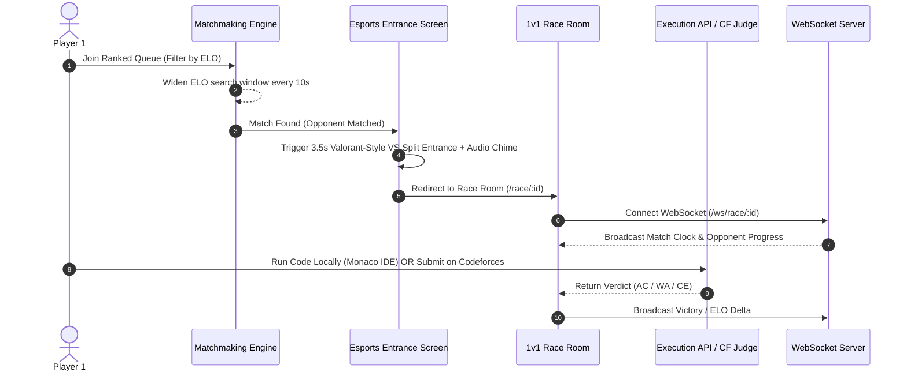
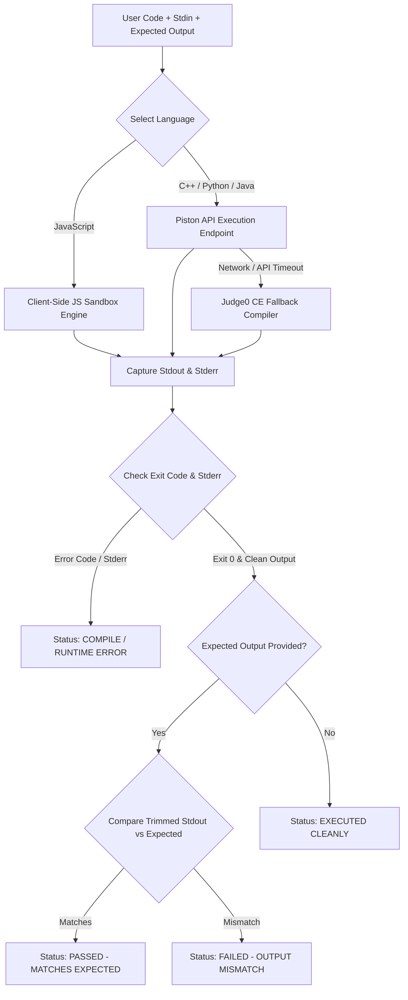

# CodeClash

CodeClash is a real-time, 1v1 competitive programming esports platform that pairs developers for speed clashes on authentic Codeforces problems. Features include Elo-rated matchmaking, an embedded multi-language IDE with local compilation, real-time verdict tracking, 3D holographic badges, and a zero-asset Web Audio sound synthesizer.

---

## Technical Stack

### Frontend
- **Core**: React 18, Vite 5, React Router v6
- **Styling & Motion**: Tailwind CSS v4, Vanilla CSS Custom Variables, Framer Motion (3D spring physics, layout animations, page transitions)
- **Audio Synthesizer**: Custom Web Audio API synthesizer (`SoundContext.jsx`) utilizing low-latency Web Audio API Oscillators, GainNodes, and Chrome async context resolution (Zero external MP3/WAV assets)
- **IDE Component**: Custom Code Editor (`CyberMonacoEditor.jsx`) supporting C++ 17, Python 3.10, Java 17, and JavaScript (Node.js 18) with smart auto-indentation and local compilation
- **Notifications**: React Hot Toast

### Backend
- **Framework**: FastAPI (Python 3.10+) running on Uvicorn ASGI server
- **WebSockets**: FastAPI WebSockets for real-time race events, player state broadcasting, and match clocks
- **Data Persistence**: PostgreSQL via `asyncpg` (with SQLite fallback for local development)
- **Authentication**: JWT tokens (`python-jose`) + Password Hashing (`bcrypt`)
- **Scraping Engine**: `httpx` + `BeautifulSoup4` for live Codeforces problem statement scraping and CORS proxying

### Code Execution APIs
- **Primary Execution Engine**: Piston API (`https://emkc.org/api/v2/piston/execute`)
- **Secondary Compiler Engine**: Judge0 CE API (`https://ce.judge0.com/submissions`)
- **Client-Side Fallback Engine**: In-browser JavaScript evaluation sandbox with stdout/stderr capture

---

## Architecture & System Workflows

### 1v1 Matchmaking & Clash Flow



### Local Code Execution & Diff Comparison Pipeline



---

## Key Features & Verified Implementation Details

### 1. Embedded Monaco Code Studio (`CyberMonacoEditor.jsx`)
- **Multi-Language Selector**: Toggle between C++ 17 (g++), Python 3.10, Java 17, and JavaScript (Node.js 18) with language-specific starter boilerplates.
- **Smart Enter Key Auto-Indentation**: Preserves leading indentation on newline and automatically indents +4 spaces when opening blocks containing `{`, `:`, or `(`.
- **Auto-Bracket Completion**: Automatic pair completion for `()`, `{}`, `[]`, `""`, and `''`.
- **Tab Key Handling**: 4-space indentation handling.
- **Test & Expected Output Tab**: Separate textareas for `stdin` inputs and `Expected Output` for test case verification.
- **Diff & Result Verdict Engine**: Compares program `stdout` against `Expected Output` and outputs explicit status badges:
  - `✓ PASSED (MATCHES EXPECTED)`
  - `⚡ EXECUTED CLEANLY`
  - `❌ FAILED (OUTPUT MISMATCH)`
  - `❌ COMPILE / RUNTIME ERROR` (with full compiler error logs)

### 2. 1v1 Matchmaking & Valorant-Style Entrance (`FindRace.jsx`)
- ELO-rated queueing system widening search boundaries dynamically every 10 seconds.
- Full-screen split-screen match entrance animation displaying Champion vs Challenger cards, handles, ELO ratings, glowing `VS` clash badge, audio cue, and a 3.5-second countdown progress bar.

### 3. Solo Practice Arena (`Practice.jsx`)
- Select target rating (800 to 2400 ELO) and problem tags (`dp`, `math`, `greedy`, `graphs`, `trees`, `strings`, `binary search`, etc.).
- 2-Column side-by-side split layout featuring a 750px+ problem statement container alongside the Monaco Code Studio.
- Live Codeforces API submission checker verifying real verdicts before clearing tasks.

### 4. 1v1 Race Room (`Race.jsx`)
- 2-Panel layout: Left panel houses the Race Clock and scraped Codeforces Problem Statement; right panel houses Race Actions and the 750px+ Monaco IDE workspace.
- Real-time WebSocket listener broadcasting opponent progress and countdown clocks.

### 5. 3D Holographic Trophy & Badges Gallery (`Badges.jsx`, `HolographicBadgeCard.jsx`)
- Interactive 3D tilt physics powered by Framer Motion (`rotateX` / `rotateY` springs).
- Dynamic metallic sheen light reflections that react to cursor movement.
- SVG circular progress rings tracking requirement completion percentages.

### 6. Zero-Asset Web Audio Synthesizer (`SoundContext.jsx`)
- Built on browser Web Audio API utilizing synthesized sine/square/sawtooth oscillators and exponential gain ramps:
  - `playCyberTap`: Navigation clicks
  - `playAction`: Primary buttons and code compilation
  - `playSadness`: Wrong answers and session quits
  - `playVictory`: Accepted verdicts and passed test cases
  - `playQueueFound`: Esports match found sound chime
- Instant global mute control toggle integrated into top Navbar on all pages.

### 7. Direct Friend Challenges (`Challenge.jsx`, `JoinChallenge.jsx`)
- Create custom challenge rooms with specific problem ratings and durations, generating shareable invite tokens (`/challenge/TOKEN`).

---

## Directory Structure

```text
CodeClash/
├── frontend/
│   ├── src/
│   │   ├── api/                   # API client (auth, races, codeforces)
│   │   ├── components/
│   │   │   ├── common/            # SpotlightCard, HolographicBadgeCard, Backgrounds
│   │   │   ├── editor/            # CyberMonacoEditor (Multi-lang IDE)
│   │   │   └── layout/            # Navbar, PageLayout, Footer
│   │   ├── context/               # AuthContext, ThemeContext, SoundContext
│   │   ├── pages/                 # Landing, Practice, Race, FindRace, Badges, Analytics, etc.
│   │   ├── App.jsx                # Router configuration & Protected Routes
│   │   ├── index.css              # Design tokens, typography, math rendering rules
│   │   └── main.jsx               # React entry point
│   └── package.json
│
├── backend/
│   ├── app/                       # FastAPI application modules
│   ├── auth.py                    # JWT authentication & bcrypt security
│   ├── cf_client.py               # Codeforces scraping & API client
│   ├── db.py                      # Database session management
│   ├── elo.py                     # ELO calculation algorithm
│   ├── matchmaking.py             # Matchmaking queue engine
│   ├── websocket.py               # Real-time WebSocket connection manager
│   ├── main.py                    # FastAPI app entry point
│   └── requirements.txt
│
└── README.md
```

---

## Installation & Setup

### Prerequisites
- Node.js (v18+)
- Python (v3.10+)

### 1. Frontend Setup
```bash
cd frontend
npm install
npm run dev
```
The application will start at `http://localhost:5173`.

### 2. Backend Setup
```bash
cd backend
python -m venv venv
# On Windows:
venv\Scripts\activate
# On Linux/macOS:
source venv/bin/activate

pip install -r requirements.txt
uvicorn main:app --reload --port 8000
```
The backend server will run at `http://localhost:8000`.

---

## Environment Variables

### Frontend (`frontend/.env`)
```env
VITE_API_URL=http://localhost:8000
VITE_WS_URL=ws://localhost:8000/ws
```

### Backend (`backend/.env`)
```env
SECRET_KEY=your_super_secret_jwt_key
DATABASE_URL=sqlite+aiosqlite:///./codeclash.db
CODEFORCES_API_URL=https://codeforces.com/api
```

---

## License

MIT License. Built for competitive programmers and software engineers.
