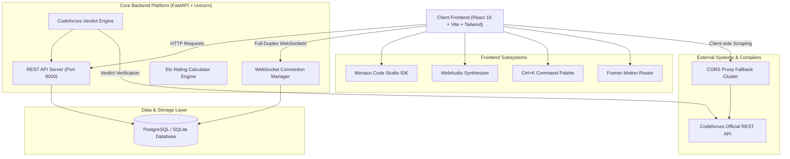
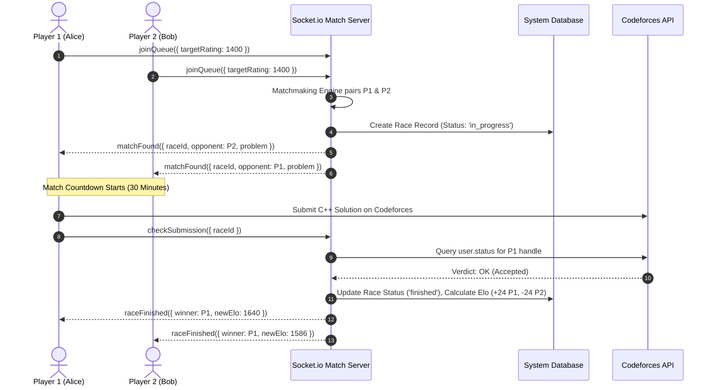

# 🏛️ CodeClash — System Design & System Architecture Specification

This document presents the low-level system design, topology, real-time WebSocket protocol specifications, rating calculation formulas, and client-side resilience mechanisms for **CodeClash**.

---

## 1. High-Level System Topology Architecture

---

## 2. Real-Time 1v1 Clash Match Sequence Flowchart

---

## 3. Elo Rating Recalculation Mathematical Model

CodeClash utilizes an enhanced zero-sum **Elo Rating Algorithm** tailored for competitive programming esports ($K = 32$):

### Expected Score Formula
$$E_A = \frac{1}{1 + 10^{(R_B - R_A) / 400}}$$

$$E_B = \frac{1}{1 + 10^{(R_A - R_B) / 400}}$$

Where:
- $R_A$: Player 1's Pre-Match Rating
- $R_B$: Player 2's Pre-Match Rating
- $E_A, E_B$: Expected probability of winning ($0 \le E \le 1$)

### Post-Match Rating Adjustment
$$R_A' = R_A + K \cdot (S_A - E_A)$$
$$R_B' = R_B + K \cdot (S_B - E_B)$$

Where:
- $K$: Scaling factor ($K = 32$)
- $S_A = 1$ if Player A wins, $S_A = 0$ if Player A loses, $S_A = 0.5$ if Draw

---

## 4. Resilience & Client-Side Proxy Architecture

To guarantee zero downtime and maximum availability:
1. **Multi-Proxy Failover Array**: Client-side statement scrapers iterate sequentially across a resilience cluster (`corsproxy.io` $\rightarrow$ `api.allorigins.win` $\rightarrow$ `api.codetabs.com`).
2. **Offline Local Compilation Engine**: In-browser JavaScript evaluation engine allows local execution without requiring backend compilers.
3. **Session Auto-Recovery**: Client state is persisted to `localStorage` metadata, allowing browser refreshes (`F5`) to recover live sessions without match interruption.
